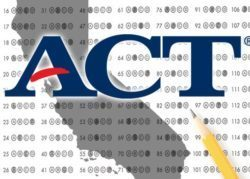

# ACT Scores

 
Analysis of ACT scores from California high schools

- EDA (Data visualization, relationship analysis)
- Modeling & Prediction
    - Linear regression (single and multivariate); training used SGD
    - Decision Treets, Random Forest
