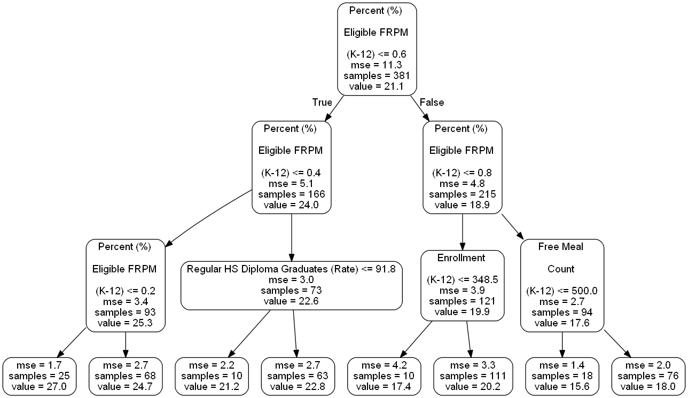

# ACT Scores
### Analysis of ACT scores from California high schools

 
What factors affect students' success on standardized test scores? What relationship do ACT scores have with poverty rates, graduation rates, dropout rates, and more? Can schoolwide performance be predicted based on these factors, and how could we improve student scores in the future?
 
 
This project aims to analyze ACT test scores from hundreds of California high schools. The first notebook uses data visualization tools to explore the relationship between the variables. The second notebook attempts to model the average ACT scores based on several factors from each school. 

[EDA (Data visualization, relationship analysis)](act_scores.ipynb)
 
[Modeling & Prediction](act_scores_ml_model.ipynb) - Linear regression ; Decision Trees: Random Forest

---

Preview of Results:
 
### Linear Regression Predictions

 
 
### Random Forest Preview

